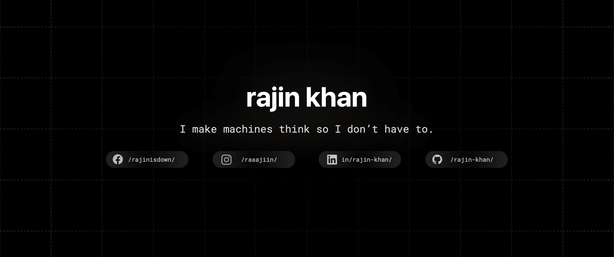

    &nbsp;
    
    &nbsp;
    
    &nbsp;
    

<h2 align="center">
    A scatterbrained developer from Bangladesh.
</h2>

    &nbsp;
    Adept at problem-solving and producing scalable projects, with additional experience in UI/UX design, Deployment, and CI/CD.

    I translate theoretical knowledge into practical solutions, incorporating AI and cutting-edge technology.

    - 🧑🏻‍💻 Check out my <a href="https://rajinkhan.com/" target="_blank" rel="noreferrer">Portfolio Website!</a>

<h3 align="center"> A bit about me: </h3>

    - 🧑🏻‍🎓 <strong>B.Sc. CSE</strong> Student at <a href="https://www.northsouth.edu" target="_blank" rel="noreferrer">North South University</a>

    - 🌃 Currently working on <strong>Understanding Deep Learning</strong>, but I also teach CS, Physics and Math (Cambridge OLs).

    - 💬 Go ahead and ask me anything about <strong>Machine Learning, Generative AI, or Web Development</strong>.

    - 🌱 Oh, and I'm always learning something new. <a href="https://github.com/rajin-khan/deep-learning-self" target="_blank" rel="noreferrer">(Find out what it is!)</a>

    - 📬 Reach out to me at: <a href="mailto:rajin.khan2001gmail.com" target="_blank" rel="noreferrer">rajin.khan2001@gmail.com</a>

<h2 align="center"> 🛠️ My favorite tools: </h2>

<h5 align="center"> Platforms, Payments, & Deployment: </h5>

    
    &nbsp;
    
    &nbsp;
    
    &nbsp;
    
    &nbsp;
    
    &nbsp;
    
    &nbsp;
    
    &nbsp;
    

---

<h5 align="center"> Web, App, & Backend: </h5>

    
    &nbsp;
    
    &nbsp;
    
    &nbsp;
    
    &nbsp;
    
    &nbsp;
    
    &nbsp;
    
    &nbsp;
    
    &nbsp;
    

---

<h5 align="center"> AI, Data, & ML: </h5>

    
    &nbsp;
    
    &nbsp;
    
    &nbsp;
    
    &nbsp;
    
    &nbsp;
    
    &nbsp;
    
    &nbsp;
    
    &nbsp;
    
    &nbsp;
    
    &nbsp;
    
    &nbsp;
    

---

<h5 align="center"> Languages: </h5>

    
    &nbsp;
    
    &nbsp;
    
    &nbsp;
    
    &nbsp;
    
    &nbsp;
    
    &nbsp;
    
    &nbsp;
    
    &nbsp;
    
    &nbsp;
    

<h2 align="center"> STATS📈: </h2>

  

    
    &nbsp;
    
  

    

<!-- h2 align="center">✨ Trophies 🏆</h2>

    
   

