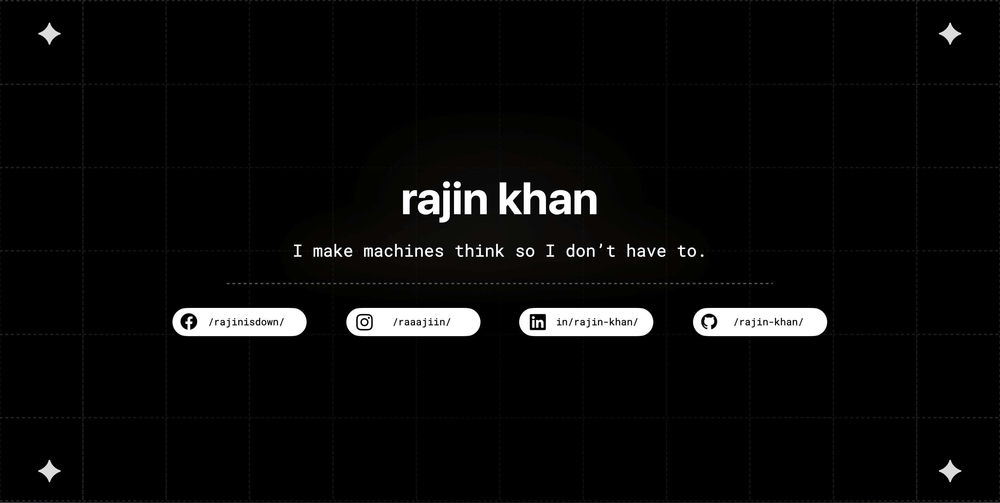

    &nbsp;
    
    &nbsp;
    
    &nbsp;
    

<h2 align="center">
    a scatterbrained developer from Bangladesh.
</h2>

    &nbsp;
    Driven by a passion for crafting innovative solutions for complex challenges, I am a Developer adept at problem-solving and producing scalable projects, with additional experience in UI/UX design.

    All my projects here demonstrate my ability to translate theoretical knowledge into practical solutions.

    - 🧑🏻‍💻 Check out my <a href="https://rajinkhan.com/" target="_blank" rel="noreferrer">portfolio website!</a>

<h3 align="center"> A bit about me: </h3>

    - 🧑🏻‍🎓 <strong>B.Sc. CSE (Honors)</strong> Student at <a href="https://www.northsouth.edu" target="_blank" rel="noreferrer">North South University</a>

    - 🌃 Currently working on <strong>Understanding Supervised Machine Learning</strong>, but I also teach CS, Physics and Math (Cambridge OLs).

    - 💬 Go ahead and ask me anything about <strong>Machine Learning, Object Oriented Programming, or App Development</strong>.

    - 🌱 Oh, and I'm always learning something new. <a href="https://github.com/rajin-khan/Tessro" target="_blank" rel="noreferrer">(Find out what it is!)</a>

    - 📬 Reach out to me at: <a href="mailto:rajin.khan2001gmail.com" target="_blank" rel="noreferrer">rajin.khan2001@gmail.com</a>

<h2 align="center"> 🛠️ My favorite tools: </h2>

<h3 align="center"> 👨‍💻 Languages: </h3>

    
    &nbsp;
    
    &nbsp;
    
    &nbsp;
    
    &nbsp;
    
    &nbsp;
    
    &nbsp;
    
    &nbsp;
    
    &nbsp;

<h3 align="center"> 🗂 Databases, Frameworks, & Libraries 📱: </h3>

    
    &nbsp;
    
    &nbsp;
    
    
    
    

<h3 align="center"> 💻 Tools and Software: </h3>

    
    &nbsp;
    
    &nbsp;
    
    &nbsp;
    
    &nbsp;
    

<h2 align="center"> STATS📈: </h2>

    

        
        

        
        &nbsp;
        
    

    

